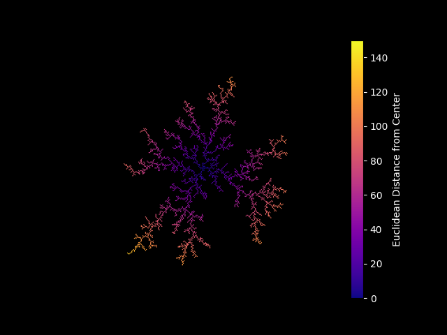
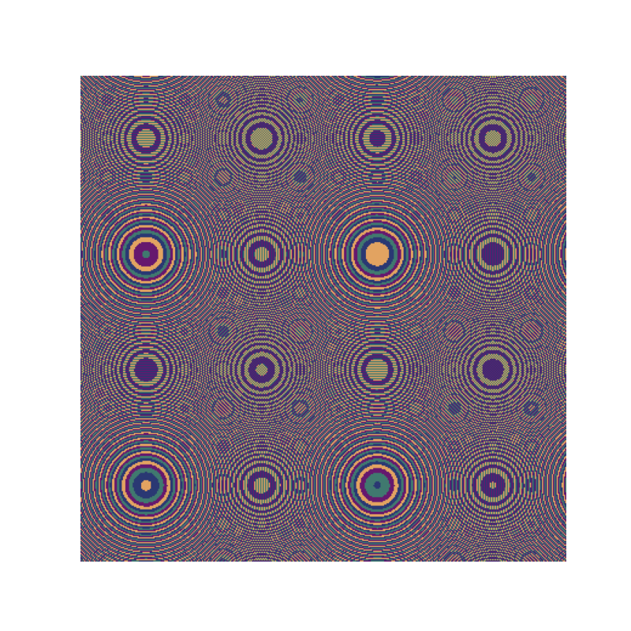
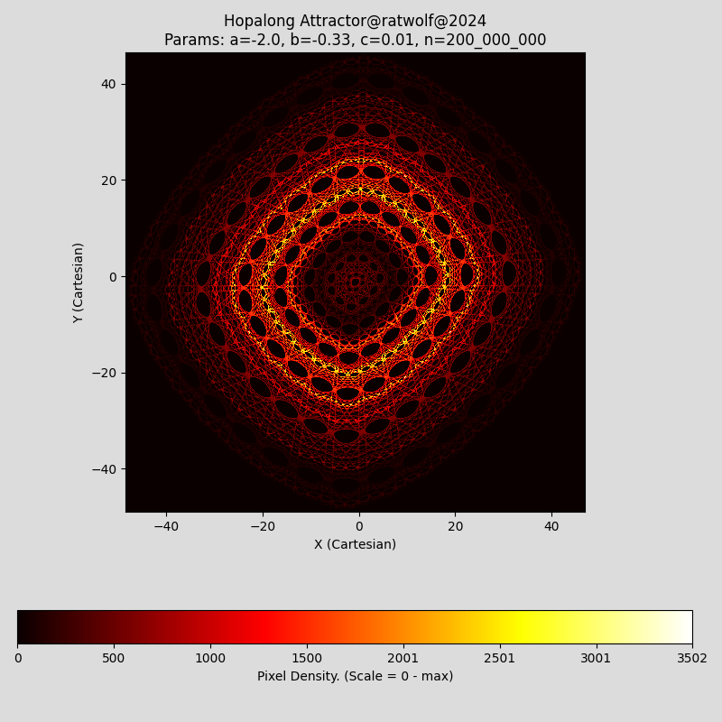
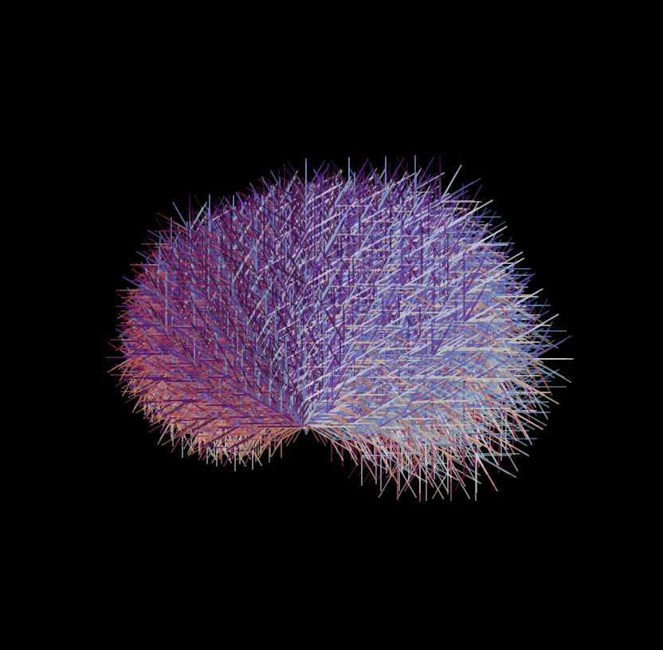

# The Beauty of Mathematics

"The mathematician's patterns, like the painter's or the poet's, must be beautiful;  
the ideas, like the colors or the words, must fit together in a harmonious way.  
Beauty is the first test: there is no permanent place in this world for ugly mathematics."

– G. H. Hardy (1877–1947)

This collection explores mathematical systems through computation, uncovering patterns, structures, and dynamics across diverse topics. Each standalone project visualizes mathematical beauty, spanning fractals, attractors, bifurcations, wave dynamics, mathematical games, iterative processes, physical pattern formation, and geometric design.

---

## 📜 Table of Contents

- [📌 Introduction](#-introduction)
- [🔬 Mathematical Structures & Patterns](#-mathematical-structures--patterns)
- [🖥️ Projects Included](#️-projects-included)
- [🚀 Explore the Beauty of Mathematics](#-explore-the-beauty-of-mathematics)
- [⚖️ MIT License](./LICENSE)

---

## 📌 Introduction

From the Mandelbrot Set to Fourier Analysis, Cellular Automata, and beyond, these repositories reveal how simple rules generate intricate patterns, dynamic behaviors, and emergent complexity. Whether tracing diffusion-limited aggregation, unraveling the Collatz Conjecture, or designing mathematical wallpapers, each project highlights the hidden artistry of mathematics.

---

## 🔬 Mathematical Structures & Patterns

Key concepts explored in these projects:

- **Fractals**: Self-similar structures in nature and mathematics, like the Mandelbrot Set.  
- **Attractors**: Patterns in dynamic systems, such as the Lorenz and Hopalong Attractors.  
- **Bifurcation & Chaos**: Small changes causing drastic shifts, seen in the Logistic Map and Feigenbaum’s constant.  
- **Wave Dynamics & Fourier Analysis**: Oscillations, signal processing, and frequency decomposition.  
- **Mathematical Games & Patterns**: Strategy and computation in the Game of Nim and Cellular Automata.  
- **Dimensional Exploration**: Investigating emergent dimensions and spatial structures.  
- **Iterative Processes**: Sequences and behaviors from repeated rules, like the Collatz Conjecture.  
- **Physical Pattern Formation**: Simple rules generating complex structures, as in diffusion-limited aggregation.  

Each project offers a window into the hidden patterns and fundamental principles shaping mathematical systems.

---

## 🖥️ Included Projects

| 📂 Project | 🔍 Description |
|------------|----------------|
| [**3D Wave**](https://github.com/ratwolfzero/3D_Wave) | Simulation of wave dynamics in 3D. |
| [**Bifurcation Diagram**](https://github.com/ratwolfzero/Bifurcation) | Visualizing chaos and Feigenbaum’s constant in the logistic map. |
| [**Cellular Automaton**](https://github.com/ratwolfzero/Cellular-Automaton) | 2D grid-based simulations. |
| [**Collatz Conjecture**](https://github.com/ratwolfzero/Collatz) | Visualization of the famous Collatz sequence. |
| [**Cryptography**](https://github.com/ratwolfzero/Crypto) | Mathematical explorations in cryptography. |
| [**DLA Aggregation**](https://github.com/ratwolfzero/DLA) | Diffusion-limited aggregation. |
| [**Emergent Dimension**](https://github.com/ratwolfzero/Emergent-Dimension) | Exploring dimensional emergence. |
| [**Fourier Analysis**](https://github.com/ratwolfzero/FFT) | Unveiling signal content through frequency decomposition. |
| [**Golomb Fractal**](https://github.com/ratwolfzero/Golomb) | Fractal designs with Golomb rulers. |
| [**Henon Map**](https://github.com/ratwolfzero/Henon) | Chaotic dynamical system. |
| [**Hopalong Attractor**](https://github.com/ratwolfzero/hopalong_python) | Visually intriguing attractor. |
| [**Lorenz Attractor**](https://github.com/ratwolfzero/Lorenz) | Chaotic system that models atmospheric convection. |
| [**Mandelbrot Set**](https://github.com/ratwolfzero/Mandelbrot) | Visualization of the famous fractal. |
| [**Game of NIM**](https://github.com/ratwolfzero/NIM) | Mathematical game based on binary strategy. |
| [**Wallpaper for the Mind**](https://github.com/ratwolfzero/Wallpaper_for_the_Mind) | Mathematical wallpaper generator. |
| [**Quaternion Rotation**](https://github.com/ratwolfzero/Quaternion_3D_Rotation)) | Smooth 3D rotation with quaternions; avoids gimbal lock. |

---

📌 *Click on each project link for more details.*

---

## 🚀 Explore the Beauty of Mathematics 

Discover how simple rules give rise to intricate patterns, where order and randomness coexist.

---
